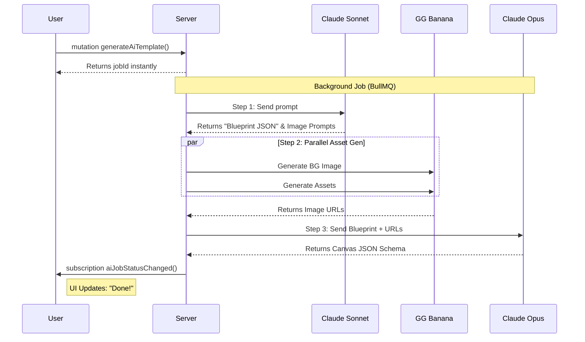

# SCIO Clone App – Development Plan

**OptiSigns Take-Home Assignment**
**Role:** Mid/Senior Fullstack Developer (React / NestJS)
**Author:** Sy Truong · June 2026

---

> **Assignment Requirements:**
> 1. List high-level TODOs
> 2. List features to implement
> 3. Provide a rough estimation (timeline)

---

## 1. My Understanding of SCIO

After the 15-minute walkthrough and exploring the live platform at `app.optisigns.com`, here is what I understand SCIO does:

SCIO is a **Digital Signage Content Management System**. The core workflow is:

```
Register screen (6-digit code) → Upload content → Build playlist → Schedule → Push to screens
```

**What I observed in the UI:**

| Navigation Tab | What It Does |
|---|---|
| **Screens** | Pair physical displays, organize in folders with team-level security, view status |
| **Files/Assets** | Upload images/videos/docs, add apps (Weather, ESPN, YouTube), organize in folders |
| **Playlists** | Drag-and-drop editor to arrange assets with duration/transition settings |
| **Schedules** | Weekly calendar (Sun–Sat, hourly grid) to assign playlists to time slots |
| **Templates** | Gallery of pre-built designs with search and categories |
| **Engage** | Interactive features: Touch Screen Kiosks, QR Overlay, Lift and Learn, etc. |
| **Analytics** | Playback Report with charts (Duration + Play Count) and data tables |

**Key patterns I noticed:**
- Multi-tenant: everything scoped to an organization
- Folder-based organization with team-level security (Everyone on team / Everyone in account / Admin Only)
- "Shared with me" filter in every module
- Consistent sidebar + main content layout across all pages
- Grid/list view toggles on all listing pages
- "Push to Screens" as a core action from playlists and schedules

---

## 2. Features to Implement

I'm organizing features into 3 priority tiers. The MVP should be usable end-to-end: a user can register, upload content, build a playlist, schedule it, and push to a screen.

### 🟢 Priority 1 — Core MVP (must-build first)

These are the features without which the app is not functional:

| # | Feature | What to Build |
|---|---|---|
| 0a | **Global Search (all pages)** | Reusable `<SearchBar>` component with 300 ms debounce, URL-synced (`?search=` query param), wired to every listing page via Apollo Client — Screens, Files/Assets, Playlists, Schedules, Templates, Device Management  |
| 1 | **Authentication** | Register (creates org + first user via Firebase), login (Firebase SDK — Email/Password, Google, Facebook OAuth), logout (revoke Firebase sessions), protected routes (Firebase ID Token verification on backend) |
| 2 | **Screen Management** | Add Screen modal (6-digit pairing code), screens list with search/filter/sort, list/grid view toggle, folder organization, status badges (online/offline/issue) |
| 2a | **Screen-Page Folder Actions** | Per-folder context menu on the Screens page: Move (relocate folder in tree), Rename (edit folder name inline), Change Permission (update access level + team), Remove (delete folder with confirmation) |
| 3 | **Folders & Permissions** | Create folder with name + security settings (team picker, access level: team/account/admin_only, permission: view/edit), nested folder tree, shared across all modules |
| 4 | **Files/Assets Library** | Upload files via presigned S3 URL (drag & drop), asset grid/list with thumbnails, sidebar filters (All/Images/Videos/Docs/Apps/Shared with me), breadcrumb navigation, "Updated X days ago" timestamps |
| 4a | **Asset Context Menu** | Per-asset right-click/kebab menu with 15 actions (see Phase 2 for full breakdown): Set Asset to Live/Expire, Push To Screens, Add to Playlists, Replace Thumbnail, Duplicate Asset, Edit Tags, Show Playlists Using This, Download, Copy URL, Copy Asset ID, Replace Asset, Move To, Rename, Get Info, Delete |
| 5 | **Playlist Editor** | Create playlist, numbered item list with thumbnails, drag-and-drop reorder (dnd-kit), right panel asset picker with search, duration per item (seconds), "Drag items here or click to browse" drop target, Playlist Options modal (scale Image/Video/Document, shuffle, transition type+speed, max duration, tags), per-item Asset Options modal (transition override, target tags, item schedule, play every) |
| 6 | **Schedule Editor** | Weekly calendar view (Sun–Sat columns, hourly rows, "All Day" row), Add Event to assign playlist to time slot, Today highlight, prev/next week navigation, schedule resolver (what playlist plays on screen X right now?) |
| 7 | **Push to Screens** | Assign playlist or schedule to screen(s), push content update action |

### 🟡 Priority 2 — Enhanced Features (after MVP works)

These make the app closer to production SCIO but are not blockers:

| # | Feature | What to Build |
|---|---|---|
| 8 | **Device Management** | Separate device management page with sidebar (Devices/Fleets/Room Integrations), status dashboard cards (Total/Online/Issue/Offline), filter tabs (All/Online/Offline >24h/Has issue/Unassigned), fleet grouping |
| 9 | **Teams & Roles** | Invite members by email, role management (owner/admin/editor/viewer), role-based API guards on all endpoints, "Shared with me" filter across all modules |
| 10 | **Apps Integration** | "Add App" modal with search, Popular Apps section (Designer/Weather/Canva/etc.), apps stored as special asset types with JSONB config |
| 11 | **Real-time Updates** | WebSocket gateway for screen heartbeat, live online/offline status, push notification when content changes |
| 12 | **Templates Gallery** | Template page with hero banner, search, category sidebar (All/Featured/Popular/Your Templates/etc.), template cards with previews |

### 🔵 Priority 3 — Production Polish (stretch goals)

| # | Feature | What to Build |
|---|---|---|
| 13 | **Analytics** | Playback Report page: date range picker, dual-axis chart (Duration + Play Count), Day/Week/Month toggle, asset data table with sorting/pagination, export as **CSV / Excel (.xlsx) / PDF** |
| 14 | **Engage Module** | Interactive content wizard (Touch Screen Kiosks, QR Overlay, Lift and Learn, AI Camera) — multi-step flow: Select type → Build → Assign |
| 15 | **Advanced Features** | Asset preview modal (image/video/PDF), asset usage tracking, audit log, bulk actions, undo/redo in playlist editor, responsive design, accessibility (WCAG 2.1 AA) |

---

## 3. High-Level TODOs

Here is the work broken down into clear, actionable phases. Each phase has a clear goal and deliverable so I know when it's "done."

### Phase 0 — Project Setup & Auth
**Goal:** Monorepo running, database connected, can register and login.

- [ ] Initialize monorepo with npm workspaces + Turborepo
  - `apps/web` → React 18 + Vite + TypeScript
  - `apps/api` → NestJS + TypeScript
  - `packages/shared-types` → shared DTOs, enums, interfaces
- [ ] Set up Docker Compose for local dev (PostgreSQL 16, Redis 7, MinIO)
- [ ] Design and create database schema with Prisma, run initial migration
- [ ] Set up **Firebase project** (Authentication enabled):
  - Enable **Email/Password** provider (Identity Toolkit)
  - Enable **Google OAuth** provider
  - Enable **Facebook OAuth** provider
  - Download `serviceAccountKey.json` for Firebase Admin SDK (backend)
  - Add `firebaseConfig` to frontend env vars
- [ ] **Auth flow (Firebase-first):**
  - **Frontend:** Firebase SDK handles sign-in — `signInWithEmailAndPassword()`, `signInWithPopup(googleProvider)`, `signInWithPopup(facebookProvider)`
  - Firebase returns an **ID Token** (short-lived JWT, 1 hour) after successful sign-in
  - Frontend attaches ID Token in every Apollo request: `Authorization: Bearer <firebaseIdToken>`
  - **Backend:** Firebase Admin SDK (`firebase-admin`) verifies the ID Token on each request: `admin.auth().verifyIdToken(token)` → injects decoded user into GraphQL context
  - On first login, backend auto-creates a user record in PostgreSQL linked to `firebase_uid`
  - Token refresh is handled entirely by Firebase SDK client-side — no refresh token logic needed on backend
- [ ] **GraphQL Auth Mutations (minimal):**
  - `mutation Logout: Boolean` → calls `admin.auth().revokeRefreshTokens(uid)` on backend to invalidate all Firebase sessions for the user
  - `mutation SyncUser: User` → called after first Firebase sign-in to create/fetch the user record + org in PostgreSQL (idempotent)
  - `query Me: User` → returns current user profile from PostgreSQL (Firebase UID looked up from context)
  - *(No `register`, `login`, `refreshToken` mutations — all handled client-side by Firebase SDK)*
- [ ] Set up S3 presigned URL helper (MinIO in dev, AWS S3 in prod)
- [ ] Build React app shell:
  - React Router v6 with nested layouts
  - `AppLayout` (top navbar with all 7 tabs + sidebar)
  - `AuthLayout` (centered card for login/register)
  - Protected route wrapper (redirect to login if no token)
  - Apollo Client with auth link (attaches Firebase ID Token from `getIdToken()` as Bearer header), HTTP link (queries/mutations), WS link (subscriptions), and error link (auto-refresh token if expired via `currentUser.getIdToken(true)`)
- [ ] Set up design system foundation: CSS variables, color tokens, typography
- [ ] **Build shared `<SearchBar>` component** (used on every listing page):
  - Controlled `<input type="search">` with clear (✕) button
  - `useDebounce(value, 300)` custom hook — prevents API call on every keystroke
  - Syncs to URL via `useSearchParams` so the query survives page refresh / back-button
  - Each page passes `search` as an Apollo query variable: `variables: { search, folderId, status }` — Apollo re-fetches automatically when variables change
  - Backend: all list queries accept a `search: String` argument and apply `ILIKE '%term%'` on name/title fields

  | Page | Search Scope (what fields are matched) |
  |---|---|
  | **Screens** | Screen name |
  | **Files/Assets** | Asset name, tags |
  | **Playlists** | Playlist name |
  | **Schedules** | Schedule name |
  | **Templates** | Template name, category, tags |
  | **Device Management** | Device name, fleet name |

  > **Analytics**  uses **filters** (date range picker, Day/Week/Month toggle, asset type filter).

**✅ Done when:** Can register, login, see the app shell with navigation tabs, and the SearchBar component is built and reusable.

---

### Phase 1 — Screens & Folders
**Goal:** Can pair a screen, organize screens in folders with security settings.

- [ ] **API:** Screens — GraphQL Queries & Mutations
  - `query screens(search, folderId, status, after, first): ScreenConnection` → paginated list
  - `query screen(id): Screen` → detail + assigned content
  - `mutation pairScreen(code, name): Screen` → pair by 6-digit code
  - `mutation updateScreen(id, input): Screen` → rename, move folder, assign playlist/schedule
  - `mutation deleteScreen(id): Boolean`
  - `mutation pushToScreens(screenIds, playlistId?, scheduleId?): Boolean`
- [ ] **API:** Folders — GraphQL Queries & Mutations
  - `query folders(type): [Folder]` → list by type (screen/asset/playlist/schedule)
  - `mutation createFolder(input): Folder` → create with name, type, access level, teamId
  - `mutation renameFolder(id, name): Folder` — "Rename"
  - `mutation moveFolder(id, parentId): Folder` — "Move"
  - `mutation updateFolderPermissions(id, input): Folder` — "Change Permission"
  - `mutation deleteFolder(id, cascade): Boolean` — "Remove"
- [ ] **UI:** Screens page
  - Search bar, sort dropdown, filter buttons
  - Grid/list view toggle
  - Left sidebar with folder tree
  - Screen cards showing name, status badge, assigned content, last seen
- [ ] **UI:** Add Screen modal (pairing code input, lowercase toggle, Help/Cancel/Pair buttons)
- [ ] **UI:** New Folder modal (folder name, Advanced → Security with team picker + access level dropdown)
- [ ] **UI:** Folder context menu (right-click or `⋮` on each folder in the sidebar/grid on the Screens page)

  | Menu Action | What It Does | UI Behavior |
  |---|---|---|
  | **Move** | Relocate folder to a different parent in the folder tree | Opens folder-tree picker modal (excludes itself and its own descendants); calls `moveFolder` mutation |
  | **Rename** | Edit the folder's display name | Inline edit in the sidebar or a rename modal; calls `renameFolder` mutation |
  | **Change Permission** | Update who can access this folder and at what level | Opens the Security modal (team picker dropdown + access level: Everyone on team / Everyone in account / Admin Only + permission: View / Edit); calls `updateFolderPermissions` mutation |
  | **Remove** | Delete the folder | Confirmation dialog; if folder contains screens or sub-folders, warn user and offer "Move contents" or "Delete all" options; calls `deleteFolder` mutation |

**✅ Done when:** Can add screens, create folders with security, search and filter screens, and perform Move / Rename / Change Permission / Remove on any folder from the Screens page.

---

### Phase 2 — Files/Assets Library
**Goal:** Can upload files, browse library, filter by type, organize in folders.

- [ ] **API:** Assets — GraphQL Queries & Mutations
  - `mutation requestUploadUrl(input): UploadUrl` → get presigned S3 URL for direct browser upload
  - `mutation createAsset(input): Asset` → register uploaded asset metadata after S3 upload
  - `query assets(search, type, folderId, after, first): AssetConnection` → paginated list
  - `query asset(id): Asset` → full detail: id, name, type, size, url, dimensions, duration, tags, usedInPlaylists
  - `query assetUsage(id): [Playlist]` → which playlists use this asset
  - `query assetDownloadUrl(id): String` → presigned S3 force-download URL
  - `mutation updateAsset(id, input): Asset` → rename, move folder, update tags
  - `mutation deleteAsset(id): Boolean` → soft delete (warns if used in playlists)
- [ ] **API:** Per-asset actions — GraphQL Mutations
  - `mutation setAssetLiveExpire(id, liveAt, expireAt): Asset` → configure live/expiry dates
  - `mutation pushAssetToScreens(id, screenIds): Boolean` → push asset directly to screens
  - `mutation addAssetToPlaylists(id, playlistIds): Boolean` → append to multiple playlists
  - `mutation replaceAssetThumbnail(id): UploadUrl` → presigned URL to upload custom thumbnail
  - `mutation duplicateAsset(id): Asset` → clone asset record (same file, new metadata)
  - `mutation replaceAssetFile(id): UploadUrl` → new presigned URL to replace the underlying file
  - `mutation moveAssetToFolder(id, folderId): Asset` → "Move To"
  - `mutation renameAsset(id, name): Asset` → "Rename"
  - *(Copy Asset ID / Copy URL are client-side actions — no mutation needed, data already in Apollo cache)*
- [ ] **API:** Thumbnail generation (BullMQ background job on upload)
- [ ] **UI:** Assets page
  - Grid/list view toggle, sort
  - Breadcrumb navigation ("Home > Folder Name > ...")
  - `+ Create` dropdown, New Folder button
  - Asset cards: thumbnail, filename, "Updated X days ago", type icon
- [ ] **UI:** Left sidebar with Upload Files button, Apps/Templates/Feeds shortcuts, filter by type (All/Images/Videos/Docs/Apps/Shared with me)
- [ ] **UI:** Upload dropzone (react-dropzone): drag & drop, multi-file, progress indicators, MIME validation
- [ ] **UI:** Asset preview modal (image viewer, video player, PDF embed)
- [ ] **UI:** Asset context menu (right-click or kebab `⋮` on each asset card)

  | Menu Action | What It Does | UI Behavior |
  |---|---|---|
  | **Set Asset to Live/Expire** | Configure live start date and/or expiry date | Opens a date-time picker modal; asset auto-activates/deactivates at configured times |
  | **Push To Screens** | Directly push this asset to one or more screens | Opens screen-picker modal (multi-select), then calls `pushAssetToScreens` mutation |
  | **Add to Playlists** | Add this asset into one or more playlists | Opens playlist-picker modal (multi-select with search), appends asset to each selected playlist |
  | **Replace Thumbnail** | Upload a custom thumbnail image for this asset | Opens file picker (image only), uploads via presigned URL, updates `thumbnail_url` |
  | **Duplicate Asset** | Create a copy of this asset record | Inline action → shows toast "Asset duplicated", new card appears in same folder |
  | **Edit Tags** | Add/remove tags on the asset | Opens tag editor modal (chip-style input with autocomplete from org tags) |
  | **Show Playlists Using This** | List all playlists that contain this asset | Opens a read-only info panel/modal showing playlist names with links |
  | **Download** | Download the original file to local disk | Triggers `assetDownloadUrl` query → browser file download using returned presigned URL |
  | **Copy URL** | Copy the asset's public URL to clipboard | Retrieves `url` from `asset` query, copies to clipboard, shows "Copied!" toast |
  | **Copy Asset ID** | Copy the asset UUID to clipboard | Copies `asset.id` from current data, shows "Copied!" toast (no API call) |
  | **Replace Asset** | Swap the underlying file while keeping the same asset record/ID | Opens file picker, gets presigned URL via `replaceAssetFile` mutation, uploads replacement |
  | **Move To** | Move asset to a different folder | Opens folder-tree picker modal, calls `moveAssetToFolder` mutation |
  | **Rename** | Rename the asset | Inline edit on the card title or a rename modal, calls `renameAsset` mutation |
  | **Get Info** | View full asset metadata | Opens an info panel/modal: filename, type, size, dimensions/duration, created by, created at, updated at, folder path, tags, playlist usage count |
  | **Delete** | Delete the asset | Confirmation dialog; warn if asset is used in playlists; calls `deleteAsset` mutation |

**✅ Done when:** Can upload files, browse library with grid/list views, filter by type, organize in folders, and perform all 15 context menu actions on any asset.

---

### Phase 3 — Playlist Editor
**Goal:** Can create playlists, add assets via drag-and-drop, configure options.

- [ ] **API:** Playlists — GraphQL Queries & Mutations
  - `query playlists(search, folderId, after, first): PlaylistConnection` → paginated list
  - `query playlist(id): Playlist` → includes ordered items with full asset details in one query
  - `mutation createPlaylist(input): Playlist` → create with name, folder
  - `mutation updatePlaylist(id, input): Playlist` → name, settings, options
  - `mutation deletePlaylist(id): Boolean`
  - `mutation reorderPlaylistItems(id, items: [PlaylistItemInput]): Playlist` → full item list replace (DnD reorder)
  - `mutation pushPlaylistToScreens(id, screenIds): Boolean`
- [ ] **UI:** Playlists list page
  - Left sidebar: Home / Shared with me / Folders tree / Playlists tree
  - `+ Create Playlist` button
- [ ] **UI:** Playlist editor page
  - Header: playlist name, color dot, item count, total size, total duration
  - Toolbar: undo/redo, preview, asset options, playlist settings, Push to Screens
  - Numbered item list: # / thumbnail / title / type icon / duration (sec)
  - Drag handles for reorder (dnd-kit)
  - Drop area at bottom: "+ Drag items here or click to browse assets"
- [ ] **UI:** Right panel — Asset picker
  - Search bar, sort/filter icons, `+ New` button
  - Folders section (collapsible)
  - Assets section with thumbnails and type labels
  - Drag from picker → playlist
- [ ] **UI:** Playlist Options modal
  - Scale Settings: Image / Video / Document (Fit/Fill/Stretch dropdowns)
  - Shuffle toggle
  - Transition: Default Transition type + Transition Speed dropdowns
  - Advanced: Playlist Max Duration (seconds), Adv. playback settings scope, Tags
- [ ] **UI:** Asset Options modal (per-item)
  - Transition: dropdown (Use Playlist Default / custom)
  - Adv. playback settings apply to: dropdown (All)
  - Target tags: dropdown (Use Playlist Default / custom)
  - Item Schedule: dropdown (No Schedule / custom)
  - Play Every: dropdown (No Repeat / every 2 / every 3 / etc.)

**✅ Done when:** Can create a playlist, drag assets into it, reorder, configure playlist + per-item options, push to screen.

---

### Phase 4 — Schedule Editor
**Goal:** Can create weekly schedules, add events to time slots, assign playlists.

- [ ] **API:** Schedules — GraphQL Queries & Mutations
  - `query schedules(search, folderId, after, first): ScheduleConnection`
  - `query schedule(id): Schedule` → includes all events with playlist details in one query
  - `mutation createSchedule(input): Schedule`
  - `mutation updateSchedule(id, input): Schedule`
  - `mutation deleteSchedule(id): Boolean`
  - `mutation addScheduleEvent(scheduleId, input): ScheduleEvent` → day_of_week, start_time, end_time, playlist_id
  - `mutation updateScheduleEvent(scheduleId, eventId, input): ScheduleEvent`
  - `mutation deleteScheduleEvent(scheduleId, eventId): Boolean`
  - `mutation pushScheduleToScreens(id, screenIds): Boolean`
- [ ] **API:** Schedule resolver
  - `query screenCurrentContent(screenId): Playlist` → resolve which playlist is active right now
  - Priority logic: specific date event > recurring day-of-week event > default playlist
  - Unit tests for edge cases (overlapping events, no events, midnight crossing)
- [ ] **UI:** Schedules list page
  - Left sidebar: Home / Shared with me / Schedules tree
  - `+ Create Schedule` button, search, sort/filter
- [ ] **UI:** Schedule editor — weekly calendar view
  - Header: schedule name, breadcrumbs
  - Navigation: Today button, prev/next arrows, date range display, "Week" toggle
  - Toolbar: Push to Screen, Add Event, preview/duplicate/export/delete/settings icons
  - Calendar grid: Sun–Sat columns, hourly rows (6AM → midnight), "All Day" row
  - Today's column highlighted in green
  - Event blocks: colored rectangles on calendar, click to edit
- [ ] **UI:** Add Event modal
  - Select playlist from dropdown
  - Pick day of week + start/end time
  - Recurring toggle (weekly vs. specific date)

**✅ Done when:** Can create a weekly schedule, add time-slot events with playlists, push schedule to a screen.

---

### Phase 5 — Device Management & Teams
**Goal:** Fleet management, team invites, role-based access control.

- [ ] **API:** Fleet CRUD, device status aggregation (total/online/issue/offline counts)
- [ ] **API:** Team management (invite by email, accept invite, role CRUD: owner/admin/editor/viewer)
- [ ] **API:** Role-based guards on all existing endpoints
- [ ] **API:** "Shared with me" query logic across all entities
- [ ] **UI:** Device Management page
  - Sidebar: Manage (Devices/Fleets) / Room Integrations / Other (Provisioning/Wi-Fi)
  - Status cards: Total devices / Online / Issue / Offline
  - Filter tabs: All / Online / Offline >24h / Has issue / Unassigned / + New view
  - Search, fleet dropdown, Columns picker, list/grid view
  - Fleets / Export / Add device buttons
- [ ] **UI:** Team page (member list, invite modal, role dropdown, remove member)
- [ ] **UI:** "Shared with me" filter in all module sidebars

**✅ Done when:** Can manage device fleets, invite team members with roles, see shared content.

---

### Phase 6 — Apps, Templates & Real-time
**Goal:** App integrations, template gallery, WebSocket live status.

- [ ] **API:** App assets (Weather, Clock, RSS as special types with JSONB config)
- [ ] **API:** Template CRUD (store, categorize, search)
- [ ] **API:** WebSocket gateway (screen heartbeat, status broadcast per org room, content push)
- [ ] **UI:** Add App modal (search, Popular Apps grid, All Apps grid)
- [ ] **UI:** Templates page (hero banner + search, trending tags, "Try AI Designer" CTA, category sidebar, featured/popular sections with template cards)
- [ ] **UI:** Live status updates (real-time badges, auto-updating device counts)

**✅ Done when:** Can add apps as assets, browse templates, see live screen status updates.

---

### Phase 7 — Analytics, Testing & Polish
**Goal:** Playback analytics, test coverage, production readiness.

- [ ] **API:** Analytics — GraphQL Queries & Mutations
  - `query playbackReport(startDate, endDate, groupBy, type)` → aggregated data for chart
  - `query playbackRows(startDate, endDate, type, after, first)` → raw data for table
  - `mutation exportPlaybackReport(startDate, endDate, format: CSV|EXCEL|PDF)` → creates background job, returns presigned S3 download URL
- [ ] **UI:** Playback Report page
  - Date range picker, dual-axis chart (Duration + Play Count), Day/Week/Month tabs
  - Filters: asset type, screen, playlist (no search bar)
  - Data table (Asset Name / Asset Tag / Type / Play Count / Duration) with sorting + pagination
  - Toolbar: **Export** dropdown with three options — **CSV**, **Excel (.xlsx)**, **PDF**; calls `exportPlaybackReport` mutation and downloads from returned URL
  - Other toolbar actions: Open / Save / Filter / Refresh / Columns
- [ ] Unit tests (Jest): auth service, schedule resolver, playlist service, role guards
- [ ] Integration tests (Supertest): auth flow, screen CRUD, asset upload, playlist push
- [ ] E2E tests (Playwright): full user journey (register → pair screen → upload → playlist → schedule → push)
- [ ] Responsive layout + accessibility review (WCAG 2.1 AA)
- [ ] Performance optimization: lazy-load routes, debounced search, Redis API caching, image optimization

**✅ Done when:** Analytics working, test suite passing, app is responsive and accessible.

---

### Phase 8 — AI Designer & Web Publisher *(Stretch Goal — Product Vision, not part of core clone scope)*
**Goal:** Elevate the app from a standard CMS to an AI-driven marketing tool. Users can generate ready-to-use templates via AI prompts, edit them, and publish them instantly.

> **💡 Architectural Note (Product Ideation):** The core AI architecture assigns specific roles to the best AI models to optimize speed, cost, and quality:
> - **Claude Sonnet:** The "Planner" (Analyzes context & structures content).
> - **GG Banana (Stable Diffusion):** The "Artist" (Renders high-quality images).
> - **Claude Opus:** The "Coder/Designer" (Generates the final layout).

#### 1. The AI Generation Flow (Backend & API)
To prevent server timeouts during slow AI generation, we use an asynchronous **BullMQ Pipeline**.



- **GraphQL API:**
  - `mutation generateAiTemplate(prompt, systemPrompt)`: Triggers the BullMQ job.
  - `subscription aiJobStatusChanged(jobId)`: Pushes real-time progress updates to the frontend (e.g., "Planning...", "Drawing...", "Assembling...").
- **Canvas JSON Schema:** The final output from Claude Opus is **not raw HTML**. It is a strict JSON Schema (e.g., `[{ type: "Text", x: 10, content: "Hello" }]`) that is saved to the PostgreSQL database so it can be seamlessly edited.

#### 2. The User Interface (Frontend Canvas)
- **Generator Modal:** A sleek UI where users select a Style (e.g., Professional, Playful) and type their prompt.
- **Progress Skeleton:** Displays a real-time loading skeleton based on the GraphQL Subscription events.
- **Interactive Canvas Editor:** Once generated, the JSON schema is loaded into the drag-and-drop editor. Users can manually tweak texts, colors, and images before finalizing.

#### 3. Web Publisher & Social Export (Next.js Edge)
The publisher transforms the AI-generated data into a live, high-performance web page.

- **From Prompt to Live Website:** 
  - **Data Source:** The user's initial prompt ultimately generates a `Canvas JSON Schema` stored in PostgreSQL.
  - **Dynamic Mapping:** Next.js uses a dynamic route (e.g., `app/[slug]/page.tsx`). When triggered, it fetches the JSON and maps every node (Text, Image, Layout) directly into React Components to form the webpage.
- **ISR Caching (Edge Delivery):** 
  - **Static Generation:** Upon publishing, the server instantly converts the React component tree into a static HTML file and caches it globally on the Edge CDN.
  - **Performance:** Visitors receive the static HTML in **<50ms** with zero database load and perfect SEO indexing.
  - **Updates:** If the user edits the template, a backend webhook calls `revalidatePath()` to silently regenerate and update the edge cache.
- **Dynamic Open Graph (OG) Image:** A Serverless Edge Function (like `@vercel/og`) automatically renders a high-res thumbnail of the published page. This ensures beautiful, clickable link previews when the URL is shared on Facebook or Twitter.

**✅ Done when:** Users can input a prompt, watch AI generate an editable template, and publish it to an Edge-cached web page.

---

## 4. Tech Stack & Why

### Why These Choices (Not Others)

Before listing the stack, let me address a key decision:

#### Why GraphQL?

SCIO itself uses GraphQL, and for a CMS with this level of nested data complexity, GraphQL is the right choice — not a future migration target:

| Concern | REST Pain Point | GraphQL Advantage |
|---|---|---|
| **Nested data** | Playlist → items → assets requires multiple roundtrips or custom `?include=` params | Single query: `{ playlist { items { asset { name, thumbnail } } } }` |
| **Over-fetching** | Screens list only needs name + status, but `GET /screens` returns all fields | Client requests exactly the fields it needs — nothing more |
| **Under-fetching** | Playlist editor needs playlist + items + assets + folder = 3–4 API calls | One query fetches the entire editor state in a single request |
| **Type safety** | Manual DTO sync between frontend and backend — drift and runtime errors | GraphQL Code Generator auto-generates typed React hooks from schema (`usePlaylistQuery`) |
| **Real-time** | Separate WebSocket gateway required | GraphQL Subscriptions built-in — same schema, same connection |

**Decision: GraphQL from day one.** NestJS code-first approach with `@nestjs/graphql` + Apollo Server. Frontend uses Apollo Client v3 with GraphQL Code Generator for fully typed, auto-generated React hooks. This matches how SCIO itself is built.

### Frontend

| Concern | Choice | Why |
|---|---|---|
| Framework | **React 18 + Vite** | Fast HMR, modern bundler, matches job description |
| Language | **TypeScript** | End-to-end type safety, shared types with backend |
| Routing | **React Router v6** | Nested layouts match SCIO's tab + sidebar structure |
| Auth | **Firebase SDK** (`firebase/auth`) | `signInWithEmailAndPassword`, `signInWithPopup` (Google, Facebook OAuth) — Firebase handles token lifecycle |
| GraphQL Client | **Apollo Client v3** | Normalized cache, optimistic updates, hooks (`useQuery`, `useMutation`, `useSubscription`) |
| GraphQL Codegen | **GraphQL Code Generator** | Auto-generates typed hooks from schema — no manual DTO sync between front and back |
| Client State | **Zustand** | Lightweight store for UI state only (sidebar, modals, view mode) — Apollo handles all server state |
| Forms | **React Hook Form + Zod** | Performant, schema validation consistent with GraphQL input types |
| UI Primitives | **Radix UI** (headless) + CSS Modules | Accessible, full styling control, no vendor lock-in |
| Drag & Drop | **dnd-kit** | Maintained (react-beautiful-dnd is deprecated), supports cross-container drag |
| File Upload | **react-dropzone** | Multi-file, drag-to-upload, MIME validation |
| Calendar | **FullCalendar** or custom grid | Matches SCIO's weekly calendar layout |
| Charts | **Recharts** | Simple, composable — enough for the analytics page |
| Icons | **Lucide React** | Consistent, tree-shakeable |

### Backend

| Concern | Choice | Why |
|---|---|---|
| Framework | **NestJS** | Modular, DI, decorators — matches job description |
| Language | **TypeScript** | Shared types with frontend |
| API Layer | **`@nestjs/graphql`** + Apollo Server | Code-first: `@ObjectType`, `@Resolver`, `@Query`, `@Mutation`, `@Subscription` decorators |
| ORM | **Prisma** | Type-safe queries, excellent migrations, better DX than TypeORM for rapid development |
| Database | **PostgreSQL** | Relational model fits the org → team → screen → schedule → playlist hierarchy |
| Auth | **Firebase Authentication** (Identity Toolkit) + `firebase-admin` SDK | Email/Password + Google OAuth + Facebook OAuth — Firebase manages token issuance, refresh, and revocation. Backend verifies Firebase ID Token via `admin.auth().verifyIdToken()` — no custom JWT logic needed |
| File Storage | **AWS S3** / MinIO (local) | Presigned URL via `requestUploadUrl` mutation — browser uploads directly to S3 |
| Cache | **Redis** | PubSub backing store for Subscriptions, BullMQ job queue, field-level response caching |
| Real-time | **GraphQL Subscriptions** (Redis PubSub) | Built into Apollo Server — screen heartbeat, live status, content push |
| Validation | **class-validator + class-transformer** | Validate GraphQL input types via NestJS pipes |
| N+1 Prevention | **DataLoader** | Batch and cache Prisma calls per request — critical for deeply nested GraphQL queries |
| API Explorer | **GraphQL Playground / Apollo Studio** | Interactive schema browser, replaces Swagger |
| Job Queue | **BullMQ** (`@nestjs/bullmq`) | Async tasks: thumbnail generation, analytics exports, email notifications |


### Monorepo Layout

```
scio-clone/
├── apps/
│   ├── web/              # React + Vite SPA
│   └── api/              # NestJS GraphQL API
├── packages/
│   ├── shared-types/     # DTOs, enums, interfaces
│   └── eslint-config/    # Shared lint rules
├── docker-compose.yml
├── package.json          # npm workspaces
└── turbo.json            # Turborepo
```

---

## 5. Database Schema

### Entity Relationship Overview

```
Organization ──┬── Teams ──── Users
               ├── Folders (tree, with team-level permissions)
               ├── Screens (in folders, assigned to playlist or schedule)
               ├── Assets (in folders, referenced by playlist items)
               ├── Playlists ──── Playlist Items (ordered, each → asset)
               ├── Schedules ──── Schedule Events (weekly slots, each → playlist)
               ├── Playback Logs (analytics)
               └── Audit Logs
```

### Core Tables

```sql
-- MULTI-TENANT CORE
CREATE TABLE organizations (
  id UUID PRIMARY KEY DEFAULT gen_random_uuid(),
  name VARCHAR(255) NOT NULL,
  plan VARCHAR(50) DEFAULT 'trial',      -- trial | pro | pro_plus | engage
  created_at TIMESTAMPTZ DEFAULT NOW()
);

CREATE TABLE teams (
  id UUID PRIMARY KEY DEFAULT gen_random_uuid(),
  org_id UUID REFERENCES organizations(id),
  name VARCHAR(255) NOT NULL,
  is_default BOOLEAN DEFAULT FALSE,
  created_at TIMESTAMPTZ DEFAULT NOW()
);

CREATE TABLE users (
  id UUID PRIMARY KEY DEFAULT gen_random_uuid(),
  org_id UUID REFERENCES organizations(id),
  team_id UUID REFERENCES teams(id),
  email VARCHAR(255) UNIQUE NOT NULL,
  firebase_uid VARCHAR(128) UNIQUE NOT NULL,  -- links to Firebase Authentication
  display_name VARCHAR(255),
  avatar_url TEXT,
  role VARCHAR(20) DEFAULT 'editor',     -- owner | admin | editor | viewer
  invite_status VARCHAR(20) DEFAULT 'accepted',
  created_at TIMESTAMPTZ DEFAULT NOW(),
  updated_at TIMESTAMPTZ DEFAULT NOW()
);

-- FOLDERS (shared across screens, assets, playlists, schedules)
CREATE TABLE folders (
  id UUID PRIMARY KEY DEFAULT gen_random_uuid(),
  org_id UUID REFERENCES organizations(id),
  name VARCHAR(255) NOT NULL,
  parent_id UUID REFERENCES folders(id),
  type VARCHAR(20) NOT NULL,             -- screen | asset | playlist | schedule | engage
  access_level VARCHAR(30) DEFAULT 'team',  -- team | account | admin_only
  created_at TIMESTAMPTZ DEFAULT NOW(),
  updated_at TIMESTAMPTZ DEFAULT NOW()
);

CREATE TABLE folder_permissions (
  id UUID PRIMARY KEY DEFAULT gen_random_uuid(),
  folder_id UUID REFERENCES folders(id),
  team_id UUID REFERENCES teams(id),
  permission VARCHAR(10) DEFAULT 'edit',  -- view | edit
  created_at TIMESTAMPTZ DEFAULT NOW(),
  updated_at TIMESTAMPTZ DEFAULT NOW()
);

-- SCREENS & DEVICES
CREATE TABLE fleets (
  id UUID PRIMARY KEY DEFAULT gen_random_uuid(),
  org_id UUID REFERENCES organizations(id),
  name VARCHAR(255) NOT NULL,
  created_at TIMESTAMPTZ DEFAULT NOW(),
  updated_at TIMESTAMPTZ DEFAULT NOW()
);

CREATE TABLE screens (
  id UUID PRIMARY KEY DEFAULT gen_random_uuid(),
  org_id UUID REFERENCES organizations(id),
  name VARCHAR(255) NOT NULL,
  pairing_code VARCHAR(6) UNIQUE,
  status VARCHAR(20) DEFAULT 'offline',  -- online | offline | issue
  folder_id UUID REFERENCES folders(id),
  fleet_id UUID REFERENCES fleets(id),
  assigned_playlist_id UUID,             -- FK added after playlists table
  assigned_schedule_id UUID,             -- FK added after schedules table
  tags TEXT[],
  last_seen_at TIMESTAMPTZ,
  created_at TIMESTAMPTZ DEFAULT NOW(),
  updated_at TIMESTAMPTZ DEFAULT NOW()
);

-- FILES / ASSETS
CREATE TABLE assets (
  id UUID PRIMARY KEY DEFAULT gen_random_uuid(),
  org_id UUID REFERENCES organizations(id),
  name VARCHAR(255) NOT NULL,
  type VARCHAR(20) NOT NULL,             -- image | video | document | app
  mime_type VARCHAR(100),
  url TEXT NOT NULL,
  thumbnail_url TEXT,
  size_bytes BIGINT,
  folder_id UUID REFERENCES folders(id),
  duration_sec INT,                      -- for videos; NULL for images
  app_config JSONB,                      -- for app-type assets (weather city, RSS url, etc.)
  tags TEXT[],
  live_at TIMESTAMPTZ,                   -- when asset becomes active (NULL = immediately)
  expire_at TIMESTAMPTZ,                 -- when asset expires (NULL = never)
  created_by UUID REFERENCES users(id),
  updated_at TIMESTAMPTZ DEFAULT NOW(),
  created_at TIMESTAMPTZ DEFAULT NOW()
);

-- PLAYLISTS
CREATE TABLE playlists (
  id UUID PRIMARY KEY DEFAULT gen_random_uuid(),
  org_id UUID REFERENCES organizations(id),
  name VARCHAR(255) NOT NULL,
  folder_id UUID REFERENCES folders(id),
  is_published BOOLEAN DEFAULT FALSE,
  color VARCHAR(7),                      -- hex for color dot label
  shuffle BOOLEAN DEFAULT FALSE,
  default_transition VARCHAR(20) DEFAULT 'fade',
  transition_speed VARCHAR(10) DEFAULT 'medium',
  scale_image VARCHAR(10) DEFAULT 'fit',
  scale_video VARCHAR(10) DEFAULT 'fit',
  scale_document VARCHAR(10) DEFAULT 'fit',
  max_duration_sec INT DEFAULT 0,        -- 0 = no limit
  tags TEXT[],
  created_at TIMESTAMPTZ DEFAULT NOW(),
  updated_at TIMESTAMPTZ DEFAULT NOW()
);

CREATE TABLE playlist_items (
  id UUID PRIMARY KEY DEFAULT gen_random_uuid(),
  playlist_id UUID REFERENCES playlists(id) ON DELETE CASCADE,
  asset_id UUID REFERENCES assets(id),
  position INT NOT NULL,
  duration_sec INT DEFAULT 10,
  transition VARCHAR(20) DEFAULT 'playlist_default',
  play_every VARCHAR(20) DEFAULT 'no_repeat',
  item_schedule JSONB,
  target_tags TEXT[],
  created_at TIMESTAMPTZ DEFAULT NOW(),
  updated_at TIMESTAMPTZ DEFAULT NOW()
);

-- SCHEDULES
CREATE TABLE schedules (
  id UUID PRIMARY KEY DEFAULT gen_random_uuid(),
  org_id UUID REFERENCES organizations(id),
  name VARCHAR(255) NOT NULL,
  folder_id UUID REFERENCES folders(id),
  default_playlist_id UUID REFERENCES playlists(id),
  created_at TIMESTAMPTZ DEFAULT NOW(),
  updated_at TIMESTAMPTZ DEFAULT NOW()
);

CREATE TABLE schedule_events (
  id UUID PRIMARY KEY DEFAULT gen_random_uuid(),
  schedule_id UUID REFERENCES schedules(id) ON DELETE CASCADE,
  playlist_id UUID REFERENCES playlists(id),
  title VARCHAR(255),
  day_of_week INT,                       -- 0=Sun..6=Sat (NULL for specific dates)
  start_time TIME NOT NULL,
  end_time TIME NOT NULL,
  start_date DATE,                       -- for specific date events
  end_date DATE,
  is_recurring BOOLEAN DEFAULT TRUE,
  color VARCHAR(7),
  created_at TIMESTAMPTZ DEFAULT NOW(),
  updated_at TIMESTAMPTZ DEFAULT NOW()
);

-- ANALYTICS & AUDIT
CREATE TABLE playback_logs (
  id UUID PRIMARY KEY DEFAULT gen_random_uuid(),
  org_id UUID REFERENCES organizations(id),
  screen_id UUID REFERENCES screens(id),
  asset_id UUID REFERENCES assets(id),
  playlist_id UUID REFERENCES playlists(id),
  played_at TIMESTAMPTZ NOT NULL,
  duration_sec INT,
  created_at TIMESTAMPTZ DEFAULT NOW()
);

CREATE TABLE audit_logs (
  id UUID PRIMARY KEY DEFAULT gen_random_uuid(),
  org_id UUID REFERENCES organizations(id),
  user_id UUID REFERENCES users(id),
  action VARCHAR(50) NOT NULL,           -- create | update | delete | push | pair
  entity_type VARCHAR(30) NOT NULL,
  entity_id UUID,
  metadata JSONB,
  created_at TIMESTAMPTZ DEFAULT NOW()
);

-- DEFERRED FOREIGN KEYS (cross-table references created after all tables exist)
ALTER TABLE screens ADD CONSTRAINT fk_screens_playlist FOREIGN KEY (assigned_playlist_id) REFERENCES playlists(id);
ALTER TABLE screens ADD CONSTRAINT fk_screens_schedule FOREIGN KEY (assigned_schedule_id) REFERENCES schedules(id);

-- INDEXES FOR PERFORMANCE & TENANCY
CREATE INDEX idx_screens_org_id ON screens(org_id);
CREATE INDEX idx_screens_org_folder ON screens(org_id, folder_id);
CREATE INDEX idx_assets_org_id ON assets(org_id);
CREATE INDEX idx_assets_org_folder ON assets(org_id, folder_id);
CREATE INDEX idx_folders_org_type ON folders(org_id, type);
CREATE INDEX idx_playlists_org_id ON playlists(org_id);
CREATE INDEX idx_schedules_org_id ON schedules(org_id);
CREATE INDEX idx_playlist_items_playlist ON playlist_items(playlist_id, position);
CREATE INDEX idx_schedule_events_schedule ON schedule_events(schedule_id);
CREATE INDEX idx_playback_logs_org_screen ON playback_logs(org_id, screen_id, played_at);
```

---

## 6. GraphQL Schema

All data operations go through a single GraphQL endpoint (`POST /graphql`) served by Apollo Server via `@nestjs/graphql`. File uploads use presigned S3 URLs — the `requestUploadUrl` mutation returns a URL the browser uses to upload directly to S3. Binary data never passes through the GraphQL server.

For Analytics file exports (CSV / Excel / PDF), the `exportPlaybackReport` mutation triggers a background job to generate the file, uploads it to S3, and returns a presigned download URL.

### Core Types

```graphql
scalar DateTime
scalar Date
scalar JSON

enum UserRole          { OWNER ADMIN EDITOR VIEWER }
enum ScreenStatus      { ONLINE OFFLINE ISSUE }
enum AssetType         { IMAGE VIDEO DOCUMENT APP }
enum FolderType        { SCREEN ASSET PLAYLIST SCHEDULE ENGAGE }
enum FolderAccessLevel { TEAM ACCOUNT ADMIN_ONLY }
enum PermissionLevel   { VIEW EDIT }
enum GroupBy           { DAY WEEK MONTH }

type User           { id: ID!, email: String!, displayName: String, role: UserRole!, orgId: ID!, avatarUrl: String }
type UploadUrl      { uploadUrl: String!, assetUrl: String!, key: String! }
type PageInfo       { hasNextPage: Boolean!, endCursor: String }

type FolderPermission { teamId: ID!, permission: PermissionLevel! }
type Folder        { id: ID!, name: String!, type: FolderType!, accessLevel: FolderAccessLevel!,
                    parentId: ID, children: [Folder!]!, permissions: [FolderPermission!]! }

type Screen        { id: ID!, name: String!, status: ScreenStatus!, pairingCode: String,
                    folder: Folder, assignedPlaylist: Playlist, assignedSchedule: Schedule,
                    tags: [String!]!, lastSeenAt: DateTime }

type Asset         { id: ID!, name: String!, type: AssetType!, url: String!, thumbnailUrl: String,
                    sizeBytes: Int, folder: Folder, durationSec: Int, appConfig: JSON,
                    tags: [String!]!, liveAt: DateTime, expireAt: DateTime,
                    createdBy: User, usedInPlaylists: [Playlist!]!, createdAt: DateTime!, updatedAt: DateTime! }

type PlaylistItem  { id: ID!, asset: Asset!, position: Int!, durationSec: Int!,
                    transition: String!, playEvery: String, itemSchedule: JSON, targetTags: [String!]! }

type Playlist      { id: ID!, name: String!, color: String, folder: Folder,
                    shuffle: Boolean!, defaultTransition: String!, transitionSpeed: String!,
                    scaleImage: String!, scaleVideo: String!, scaleDocument: String!,
                    maxDurationSec: Int!, tags: [String!]!, items: [PlaylistItem!]!,
                    createdAt: DateTime!, updatedAt: DateTime! }

type ScheduleEvent { id: ID!, playlist: Playlist!, title: String, dayOfWeek: Int,
                    startTime: String!, endTime: String!, startDate: Date, endDate: Date,
                    isRecurring: Boolean!, color: String }

type Schedule      { id: ID!, name: String!, folder: Folder, defaultPlaylist: Playlist,
                    events: [ScheduleEvent!]!, createdAt: DateTime!, updatedAt: DateTime! }

# Cursor-based paginated connections
type ScreenConnection   { nodes: [Screen!]!, pageInfo: PageInfo!, totalCount: Int! }
type AssetConnection    { nodes: [Asset!]!, pageInfo: PageInfo!, totalCount: Int! }
type PlaylistConnection { nodes: [Playlist!]!, pageInfo: PageInfo!, totalCount: Int! }
type ScheduleConnection { nodes: [Schedule!]!, pageInfo: PageInfo!, totalCount: Int! }

# Analytics
enum ExportFormat      { CSV EXCEL PDF }
type PlaybackDataPoint { date: String!, playCount: Int!, durationSec: Int! }
type PlaybackReport    { data: [PlaybackDataPoint!]!, totalPlayCount: Int!, totalDurationSec: Int! }
type PlaybackRow       { assetId: ID!, assetName: String!, type: AssetType!, playCount: Int!, durationSec: Int! }

# Real-time
type ScreenHeartbeat   { screenId: ID!, status: ScreenStatus!, cpuUsage: Float, memoryUsage: Float, timestamp: DateTime! }
```

### Queries

```graphql
type Query {
  # Auth
  me: User!   # verifies Firebase ID Token from context, returns user from PostgreSQL (upserts on first call)

  # Screens
  screens(search: String, folderId: ID, status: ScreenStatus, after: String, first: Int): ScreenConnection!
  screen(id: ID!): Screen!
  screenCurrentContent(screenId: ID!): Playlist   # resolve active playlist by schedule priority

  # Assets
  assets(search: String, type: AssetType, folderId: ID, after: String, first: Int): AssetConnection!
  asset(id: ID!): Asset!
  assetUsage(id: ID!): [Playlist!]!              # which playlists contain this asset
  assetDownloadUrl(id: ID!): String!             # presigned S3 force-download URL

  # Playlists
  playlists(search: String, folderId: ID, after: String, first: Int): PlaylistConnection!
  playlist(id: ID!): Playlist!                   # returns items + assets in a single query

  # Schedules
  schedules(search: String, folderId: ID, after: String, first: Int): ScheduleConnection!
  schedule(id: ID!): Schedule!                   # returns events + playlist details

  # Folders
  folders(type: FolderType!): [Folder!]!
  folder(id: ID!): Folder!

  # Teams
  teamMembers: [User!]!

  # Analytics
  playbackReport(startDate: Date!, endDate: Date!, groupBy: GroupBy!, type: AssetType): PlaybackReport!
  playbackRows(startDate: Date!, endDate: Date!, type: AssetType, after: String, first: Int): [PlaybackRow!]!
}
```

### Mutations

```graphql
type Mutation {
  # Auth
  # Note: register / login / refreshToken are handled client-side by Firebase SDK
  # Backend only exposes two auth mutations:
  syncUser: User!    # idempotent — called after first Firebase sign-in to create/upsert user + org in PostgreSQL
  logout: Boolean!   # calls admin.auth().revokeRefreshTokens(uid) to revoke all Firebase sessions for the user

  # Screens
  pairScreen(code: String!, name: String!): Screen!
  updateScreen(id: ID!, input: UpdateScreenInput!): Screen!
  deleteScreen(id: ID!): Boolean!
  pushToScreens(screenIds: [ID!]!, playlistId: ID, scheduleId: ID): Boolean!

  # Assets
  requestUploadUrl(input: UploadUrlInput!): UploadUrl!        # presigned S3 URL for direct browser upload
  createAsset(input: CreateAssetInput!): Asset!              # register metadata after S3 upload completes
  updateAsset(id: ID!, input: UpdateAssetInput!): Asset!
  deleteAsset(id: ID!): Boolean!
  duplicateAsset(id: ID!): Asset!
  setAssetLiveExpire(id: ID!, liveAt: DateTime, expireAt: DateTime): Asset!
  pushAssetToScreens(id: ID!, screenIds: [ID!]!): Boolean!
  addAssetToPlaylists(id: ID!, playlistIds: [ID!]!): Boolean!
  replaceAssetThumbnail(id: ID!): UploadUrl!                 # new presigned URL for custom thumbnail
  replaceAssetFile(id: ID!): UploadUrl!                      # new presigned URL to replace underlying file
  moveAssetToFolder(id: ID!, folderId: ID!): Asset!
  renameAsset(id: ID!, name: String!): Asset!

  # Playlists
  createPlaylist(input: CreatePlaylistInput!): Playlist!
  updatePlaylist(id: ID!, input: UpdatePlaylistInput!): Playlist!
  deletePlaylist(id: ID!): Boolean!
  reorderPlaylistItems(id: ID!, items: [PlaylistItemInput!]!): Playlist!  # full replace for DnD reorder
  pushPlaylistToScreens(id: ID!, screenIds: [ID!]!): Boolean!

  # Schedules
  createSchedule(input: CreateScheduleInput!): Schedule!
  updateSchedule(id: ID!, input: UpdateScheduleInput!): Schedule!
  deleteSchedule(id: ID!): Boolean!
  addScheduleEvent(scheduleId: ID!, input: ScheduleEventInput!): ScheduleEvent!
  updateScheduleEvent(scheduleId: ID!, eventId: ID!, input: ScheduleEventInput!): ScheduleEvent!
  deleteScheduleEvent(scheduleId: ID!, eventId: ID!): Boolean!
  pushScheduleToScreens(id: ID!, screenIds: [ID!]!): Boolean!

  # Folders
  createFolder(input: CreateFolderInput!): Folder!
  renameFolder(id: ID!, name: String!): Folder!
  moveFolder(id: ID!, parentId: ID): Folder!
  updateFolderPermissions(id: ID!, input: FolderPermissionsInput!): Folder!
  deleteFolder(id: ID!, cascade: Boolean): Boolean!

  # Teams
  inviteMember(email: String!, role: UserRole!): User!
  updateMemberRole(userId: ID!, role: UserRole!): User!
  removeMember(userId: ID!): Boolean!

  # Analytics
  exportPlaybackReport(startDate: Date!, endDate: Date!, format: ExportFormat!): String!  # returns presigned S3 download URL
}
```

### Subscriptions

```graphql
type Subscription {
  screenStatusChanged(orgId: ID!): Screen!         # broadcast live online/offline/issue to org room
  contentUpdated(screenId: ID!): Screen!           # notify screen player to re-fetch active content
  screenHeartbeat(screenId: ID!): ScreenHeartbeat! # real-time device heartbeat
}
```


---

## 7. Project Structure

### Backend (NestJS)

```
apps/api/src/
├── main.ts
├── app.module.ts
├── config/                        # ConfigModule
├── prisma/
│   ├── schema.prisma
│   └── migrations/
├── graphql/
│   └── schema.gql                 # Auto-generated SDL (code-first output, do not edit)
├── auth/
│   ├── auth.module.ts
│   ├── auth.resolver.ts           # @Mutation: syncUser, logout; @Query: me
│   ├── auth.service.ts            # verifyFirebaseToken(), syncUser(), revokeTokens()
│   ├── firebase-admin.provider.ts # initializes firebase-admin with serviceAccountKey.json
│   ├── firebase-auth.guard.ts     # Guard: calls admin.auth().verifyIdToken(), injects user into GQL context
│   └── dto/                       # SyncUser ObjectType, User ObjectType
├── screens/
│   ├── screens.module.ts
│   ├── screens.resolver.ts        # @Query: screens, screen, screenCurrentContent
│   │                              # @Mutation: pairScreen, updateScreen, deleteScreen, pushToScreens
│   │                              # @Subscription: screenStatusChanged, contentUpdated
│   ├── screens.service.ts
│   ├── screens.dataloader.ts      # DataLoader: batch-load assigned playlists/schedules (N+1 fix)
│   └── dto/
├── assets/
│   ├── assets.module.ts
│   ├── assets.resolver.ts         # @Query: assets, asset, assetUsage, assetDownloadUrl
│   │                              # @Mutation: requestUploadUrl, createAsset, updateAsset,
│   │                              #   deleteAsset, duplicateAsset, setAssetLiveExpire, etc.
│   ├── assets.service.ts
│   ├── upload/                    # S3 presigned URL helper
│   └── dto/
├── playlists/
│   ├── playlists.module.ts
│   ├── playlists.resolver.ts      # @Query: playlists, playlist
│   │                              # @Mutation: createPlaylist, reorderPlaylistItems, pushPlaylistToScreens
│   ├── playlists.service.ts
│   └── dto/
├── schedules/
│   ├── schedules.module.ts
│   ├── schedules.resolver.ts      # @Query: schedules, schedule
│   │                              # @Mutation: createSchedule, addScheduleEvent, pushScheduleToScreens
│   ├── schedules.service.ts
│   ├── schedule-resolver.service.ts  # priority logic: specific date > recurring > default playlist
│   └── dto/
├── folders/
├── teams/
├── analytics/
│   ├── analytics.resolver.ts      # @Query: playbackReport, playbackRows; @Mutation: exportPlaybackReport
│   ├── analytics.service.ts
│   └── export.processor.ts        # BullMQ processor for generating CSV/Excel/PDF and uploading to S3
├── pubsub/
│   └── pubsub.module.ts           # Redis-backed PubSub provider (shared across @Subscription resolvers)
└── common/
    ├── guards/                    # JwtAuthGuard, RolesGuard, OrgGuard
    ├── decorators/                # @Roles(), @CurrentUser(), @OrgId()
    ├── filters/                   # GqlExceptionFilter
    ├── interceptors/              # LoggingInterceptor, QueryComplexityPlugin
    ├── dataloader/                # DataLoaderInterceptor — new DataLoader instance per request
    └── pipes/
```

### Frontend (React + Vite)

```
apps/web/src/
├── main.tsx
├── App.tsx                        # Router + providers
├── layouts/
│   ├── AppLayout.tsx              # Top navbar + sidebar
│   └── AuthLayout.tsx             # Centered card
├── pages/
│   ├── auth/                      # Login, Register
│   ├── screens/                   # ScreensPage, DevicesPage
│   ├── assets/                    # AssetsPage
│   ├── playlists/                 # PlaylistsPage, PlaylistEditorPage
│   ├── schedules/                 # SchedulesPage, ScheduleEditorPage
│   ├── templates/                 # TemplatesPage
│   └── analytics/                 # PlaybackReportPage
├── components/
│   ├── ui/                        # Button, Input, Modal, Table, Badge, etc.
│   ├── layout/                    # TopNav, Sidebar, Breadcrumb
│   ├── screens/                   # AddScreenModal, ScreenCard, StatusBadge
│   ├── assets/                    # AssetGrid, AssetCard, UploadDropzone, AddAppModal
│   ├── playlists/                 # PlaylistEditor, DndItemList, AssetPicker, Options modals
│   ├── schedules/                 # WeekCalendar, AddEventModal, EventBlock
│   └── analytics/                 # PlaybackChart, PlaybackTable
├── hooks/                         # Auto-generated typed hooks via GraphQL Code Generator
├── stores/                        # auth.store.ts, ui.store.ts (Zustand — UI state only, Apollo handles server state)
├── graphql/
│   ├── operations/                # .graphql files: queries, mutations, subscriptions
│   └── generated/                 # Auto-generated types + hooks (do not edit manually)
├── api/
│   └── client.ts                  # Apollo Client (HTTP link + WS link + auth link + error link)
├── utils/
└── types/
```

---

## 8. Timeline & Estimation

### Important Context

SCIO is a **mature product built by a full engineering team over several years**. What we're estimating below is not "rebuild SCIO" — it's "build a functional clone that demonstrates the same core architecture and UX patterns."

My estimate is structured in **3 milestones** to show what's realistic at each stage, tailored for a **5-person cross-functional team**. I provide two scenarios: **Without AI** (traditional development) vs **With AI** (leveraging Claude/CodeX for boilerplate generation, test writing, and code review).

### How I Estimated (Methodology)

Good estimation isn't guessing — it's structured reasoning. Here's how I arrived at these numbers:

1. **Task Decomposition:** Each phase was broken into concrete deliverables (API endpoints, UI components, infrastructure tasks). For example, Phase 2 (Files/Assets) = 1 presigned URL service + 1 paginated query + 15 mutation resolvers + upload dropzone UI + asset grid/list + context menu with 15 actions + thumbnail generation job.

2. **Complexity Weighting:** Each deliverable was classified:
   - **Simple** (~0.5 day): Standard CRUD endpoint, basic UI component (e.g., a filter dropdown)
   - **Medium** (~1–2 days): Feature with state management + API integration (e.g., folder tree with permissions)
   - **Complex** (~3–5 days): Novel interaction pattern requiring R&D (e.g., cross-container DnD editor, weekly calendar grid)

3. **Parallelization Factor:** With a 5-person team (1 Tech Lead + 2 FE + 2 BE), frontend and backend work runs in parallel. The phase duration is `max(FE work, BE work)` — not `FE + BE`. For example, Phase 1: BE builds Screen/Folder resolvers (3 days) **while** FE builds the Screens page UI (4 days) → phase = 4 days, not 7.

4. **Buffer (20%):** Each phase includes ~20% buffer for code reviews, unexpected bugs, cross-browser issues, and integration friction. The "Without AI" estimates include more buffer for manual boilerplate writing.

5. **AI Impact Assessment:** The "With AI" scenario assumes:
   - Boilerplate generation (CRUD resolvers, DTOs, basic React components): **~70% time savings**
   - Complex logic (DnD interactions, schedule resolver, permission cascading): **~10-20% savings** (still requires human design)
   - Testing (unit + integration + E2E): **~50% savings** (AI generates test skeletons, human reviews)
   - Overall per-phase savings: **~40-45%**

### Assumptions

- **Team Size:** 5 Members (1 Tech Lead / Fullstack, 2 Frontend Developers, 2 Backend Developers).
- Working ~6–7 focused hours/day per person.
- Familiar with React + NestJS.
- Estimates include: design, API, UI, basic tests, and debugging.
- **Does NOT include:** full production CI/CD setup, performance testing at scale, security audit, mobile/tablet optimization.

---

### Milestone 1 — Functional Prototype
**Goal:** A working demo that covers the core user journey end-to-end (auth → screens → assets → playlists → schedules → push).
*Note: The time estimates account for proper code reviews, handling edge cases, cross-browser UI quirks, and setting up testing infrastructure.*

| Phase | Scope | Without AI | With AI ⚡️ | How Estimated |
|---|---|---|---|---|
| Phase 0 — Setup & Auth | Monorepo, Docker, DB schema, Firebase auth, app shell | **5 days** | **2–3 days** | Mostly boilerplate — AI cuts significantly. Complex part is Apollo + Firebase integration (~1 day manual either way). |
| Phase 1 — Screens | Screens CRUD, folders, list/grid, search, permissions | **7 days** | **4 days** | BE: 6 resolvers (3d manual, 2d AI). FE: screens page + folder tree + modals (4d manual, 2d AI). Parallel = max. |
| Phase 2 — Files/Assets | S3 upload, library, filters, thumbnails, 15 context menu actions | **8 days** | **4–5 days** | Heaviest module: 15 mutations + upload pipeline + thumbnail job. AI handles CRUD mutations fast, but S3 presign + BullMQ needs manual setup. |
| Phase 3 — Playlists | Playlist CRUD, complex DnD editor, asset picker, options modals | **10 days** | **5–6 days** | Most complex UI. Cross-container DnD (dnd-kit) needs R&D (~3 days regardless). Options modals are form-heavy → AI accelerates significantly. |
| Phase 4 — Schedules | Schedule CRUD, weekly calendar UI, resolver priority logic | **8 days** | **4–5 days** | Calendar grid is the hardest UI component. Try FullCalendar first (1d); if too rigid, build custom CSS Grid (3d). Resolver logic needs unit tests. |
| Phase 5 — Integration | Connect all modules, E2E testing, bug fixing, UI polish | **10 days** | **6 days** | Integration friction is human work — AI helps write test suites but debugging cross-module issues is manual. 20% buffer included. |
| | **Milestone 1 Total** | **~9–10 weeks (48 days)** | **~5–6 weeks (25–29 days)** | **~45% savings with AI** |

**What's delivered:** A user can register → pair a screen → upload assets → build a playlist with drag-and-drop → schedule it on a weekly calendar → push content to screens. Basic folder organization and permissions work. Core CRUD for all modules is functional.

**What's NOT included yet:** Real-time WebSocket, device fleet management, team invites/roles, apps integration, templates gallery, analytics, Engage module, responsive design, E2E tests.

---

### Milestone 2 — Production-Ready MVP
**Goal:** The product is stable, secure, and performant enough for internal testing or beta users.

| Addition | Without AI | With AI ⚡️ | How Estimated |
|---|---|---|---|
| Team & role management (invite, RBAC, "Shared with me") | **7 days** | **4 days** | RBAC guards are pattern-heavy → AI excels. "Shared with me" query logic touches all modules → manual integration. |
| WebSocket real-time (heartbeat, live status, content push) | **8 days** | **5 days** | GraphQL Subscriptions + Redis PubSub setup is ~2d infrastructure. Heartbeat + status broadcast per org is custom logic. |
| Device management page (fleets, status dashboard, filters) | **7 days** | **4 days** | Mostly CRUD + dashboard UI. Status aggregation queries need optimization. AI handles fleet CRUD fast. |
| Apps & Templates integration (Weather, RSS, browse gallery) | **10 days** | **5–6 days** | App JSONB config system needs design. Template gallery is UI-heavy with search + categories. AI accelerates component scaffolding. |
| Analytics (playback reports, charts, data tables, export) | **8 days** | **5 days** | Recharts integration + date aggregation queries. Export pipeline (CSV/Excel/PDF via BullMQ) is ~3d manual setup. |
| Testing (unit + E2E), security audit & polish | **12 days** | **6–7 days** | AI generates ~80% of test skeletons. Security review + accessibility audit are manual. Performance profiling is manual. |
| **Milestone 2 Total** | **~10–11 weeks (52 days)** | **~6–7 weeks (29–33 days)** | **~40% savings with AI** |

---

### Milestone 3 — Full Product Parity
**Goal:** Reach parity with production SCIO (Engage, AI Publisher, Enterprise features).

This involves massive product initiatives: Engage modules (Kiosks, QR), AI Web Publisher, Integrations (Canva, Zoom), and Enterprise scalability (multi-region, audit logs).

| Scenario | Without AI | With AI ⚡️ | Notes |
|---|---|---|---|
| **Estimated Duration** | **~4–6 months** | **~2.5–3.5 months** | AI cuts SDK learning curve and prototype speed, but enterprise features (multi-region, audit, billing) require careful manual architecture. |

---

### Summary Table (5-Person Team)

| Milestone | Scope | Without AI | With AI ⚡️ | Time Saved |
|---|---|---|---|---|
| **M1 — Prototype** | Core flow (screens → assets → playlists → schedules) | **~9–10 weeks** | **~5–6 weeks** | ~45% |
| **M2 — MVP** | + Teams, real-time, device mgmt, templates, analytics | **~10–11 weeks** | **~6–7 weeks** | ~40% |
| **M3 — Full parity** | + Engage, AI Publisher, enterprise, billing, integrations | **~4–6 months** | **~2.5–3.5 months** | ~40% |
| **Total to Parity** | End-to-end mature platform | **~10–13 months** | **~5.5–7.5 months** | **~4–5 months saved** |

### What We'd Prioritize If Given 4 Weeks (5-Person Team, With AI)

With a 5-person team using Claude/CodeX, a 4-week sprint can comfortably deliver a highly polished **M1 Functional Prototype**:
1. **Week 1:** Monorepo + Docker + Prisma schema + Firebase auth + app shell (Tech Lead) **||** Screen/Folder resolvers (2 BE) **||** AppLayout + AuthLayout + SearchBar (2 FE).
2. **Week 2:** Asset resolvers + S3 upload pipeline + thumbnail job (2 BE) **||** Screens page + Assets page + upload dropzone (2 FE) **||** Code review + integration (Tech Lead).
3. **Week 3:** Playlist + Schedule resolvers + resolver priority logic (2 BE) **||** Playlist DnD editor + Schedule calendar (2 FE) **||** Push-to-Screens API (Tech Lead).
4. **Week 4:** Integration testing + bug fixes (full team) **||** UI polish + E2E tests (2 FE) **||** Performance + security review (Tech Lead + 2 BE).

This delivers the full core user journey with clean architecture, proper error handling, and test coverage — rather than rushing to add half-baked secondary features.

**The goal is to demonstrate architectural maturity, realistic scoping, and the ability to leverage AI for a high-quality codebase.**

---

## 9. Architecture Overview

```
┌──────────────────────────────────────────────────────────┐
│                  Browser (React + Vite SPA)               │
│                                                          │
│  React Router v6 │ Apollo Client v3 │ Zustand │ dnd-kit  │
│  ┌──────────┐ ┌──────────┐ ┌──────────┐ ┌───────────┐  │
│  │ Screens  │ │  Files/  │ │ Playlist │ │ Schedules │  │
│  │ Devices  │ │  Assets  │ │  Editor  │ │ Calendar  │  │
│  └────┬─────┘ └────┬─────┘ └────┬─────┘ └─────┬─────┘  │
│       │            │            │              │         │
│  ┌────┴────────────┴────────────┴──────────────┴─────┐  │
│  │ Apollo Client (HTTP link + WS link + Auth link)   │  │
│  └───────────────────────┬───────────────────────────┘  │
└──────────────────────────┼──────────────────────────────┘
                           │  HTTPS (Queries/Mutations)
                           │  WSS (Subscriptions)
┌──────────────────────────▼──────────────────────────────┐
│      NestJS GraphQL API (Apollo Server) + PubSub         │
│                                                          │
│  Resolvers: Auth │ Screens │ Assets │ Playlists          │
│             Schedules │ Folders │ Teams │ Analytics      │
│                                                          │
│  Guards: Firebase Auth │ Roles │ Org Scope │ Folder      │
│  DataLoader: N+1 prevention for nested queries           │
│                                                          │
│  ┌──────────┐  ┌───────┐  ┌───────────┐  ┌──────────┐  │
│  │PostgreSQL│  │ Redis │  │  AWS S3 / │  │ BullMQ   │  │
│  │ (Prisma) │  │PubSub │  │   MinIO   │  │ (jobs)   │  │
│  └──────────┘  └───────┘  └───────────┘  └──────────┘  │
└──────────────────────────────────────────────────────────┘
                           │ (future)
┌──────────────────────────▼──────────────────────────────┐
│         Screen Player (PWA / Electron / Android)         │
│  • Subscribes to contentUpdated(screenId) via GQL Sub    │
│  • Caches assets locally (Service Worker)                │
│  • Sends heartbeat via screenHeartbeat mutation          │
│  • Receives live status via screenStatusChanged sub      │
└──────────────────────────────────────────────────────────┘
```

### Key Data Flow: "Push to Screen"

To understand how data moves through this architecture, here is the exact flow when a user assigns a playlist to a screen:

```text
1. User clicks "Push to Screen" on the frontend
  → Frontend calls pushPlaylistToScreens mutation
  → Backend updates screens.assigned_playlist_id in DB
  → Backend publishes to Redis PubSub channel: `content:${screenId}`
  → GraphQL Subscription `contentUpdated(screenId)` fires
  → Screen player receives event via WebSocket
  → Screen player calls screenCurrentContent query to get new assignment
  → Player fetches new playlist JSON + new assets, caches them locally
  → Player starts playback of the new content
  → Player periodically sends playback_log entries back to API (analytics)
```

---

## 10. Technical Decisions & Tradeoffs

| Decision | Why | Alternative Considered |
|---|---|---|
| **GraphQL from day one** | SCIO uses GraphQL; CMS data is deeply nested (playlist → items → assets); Apollo Client's normalized cache eliminates waterfall fetches; Subscriptions cover real-time without extra infrastructure | REST — simpler initial setup but causes over/under-fetching, requires manual DTO sync, needs separate WebSocket infrastructure |
| **Firebase Authentication** | Handles Email/Password + Google + Facebook OAuth out of the box — no custom token issuance, rotation, or storage logic. Backend simply verifies Firebase ID Token via `firebase-admin`. Saves ~1 week of auth plumbing. | Custom Passport.js + JWT refresh rotation — full control but more code, more attack surface (token storage, revocation, rotation bugs) |
| **Prisma over TypeORM** | Better type safety, simpler migrations, faster iteration | TypeORM has first-class NestJS support but more boilerplate |
| **Presigned S3 URLs** | Browser uploads directly to S3, no file bytes through API server = no memory pressure or timeouts | Direct upload through API — simpler but doesn't scale |
| **Folder permissions in DB** | SCIO's team-level folder security needs flexible access control, not hardcoded rules | Role-based only (simpler but doesn't match SCIO's model) |
| **Schedule resolver as service** | "What playlist plays on screen X now?" has priority logic that needs unit testing | Inline logic in resolver — harder to test |
| **dnd-kit** | Maintained, accessible, supports cross-container drag | react-beautiful-dnd (deprecated), react-dnd (lower-level) |
| **Optimistic updates for DnD** | Instant UI feedback when reordering; `reorderPlaylistItems` mutation syncs in background | Wait for server response — feels laggy |
| **BullMQ for async jobs** | Thumbnails, CSV exports shouldn't block GraphQL responses | Process in-request — causes timeouts on large files |
| **DataLoader for N+1** | Every nested GraphQL field (playlist.items.asset) would trigger a separate DB query without it | Eager-load everything — wastes memory fetching data the client didn't request |

---

## 11. Risks & How I'd Handle Them

| Risk | What Could Go Wrong | My Mitigation |
|---|---|---|
| **Device Offline Resilience** | Screens lose internet but must keep playing. WebSockets drop frequently in retail/restaurant environments. | Implement **Offline-First** player architecture. Cache playlist JSON and media locally via IndexedDB/Service Worker. Implement background sync to queue and push playback logs when connection is restored. |
| **Playlist DnD complexity** | Cross-container drag from asset picker → playlist is hard to get right | Build a prototype on day 1 of Phase 3. dnd-kit handles this natively — but I need to learn the API. Time-box to 2 days. |
| **Weekly calendar UI** | Custom calendar grid is the most complex UI component in the app | Try FullCalendar first (1 day). If it's too rigid for SCIO's exact layout, build a simpler CSS Grid version. |
| **Schedule conflicts** | Two events overlap on the same screen | Clear priority rule: specific date > weekly recurring > default playlist. Prevent overlap in the UI with validation. |
| **Folder permission cascading** | Nested folders need inherited permissions — this gets complex fast | Start with flat folders (1 level). SCIO seems mostly flat too. Add nesting in Priority 2. |
| **Large asset libraries** | Performance with 1000+ assets | Cursor-based pagination, `react-virtual` for grid, lazy thumbnail loading, Redis caching. |
| **Real-time at scale** | Many screens heartbeating simultaneously | GraphQL Subscriptions via Redis PubSub allows horizontal scaling natively. |
| **Scope creep** | Engage module, AI Designer, Room Integrations are each mini-products | Strict Priority 1/2/3 discipline. Build MVP flow first, polish later. |

---

## 12. What I'd Improve At Scale

If this clone needed to serve production traffic:

1. **GraphQL Persisted Queries** — Cache frequently-used query hashes on the CDN edge to reduce payload size and improve latency at scale.
2. **CDN for assets** — CloudFront in front of S3 for fast delivery to geographically distributed screens.
3. **Event-driven architecture** — NestJS EventEmitter or Kafka: "playlist updated" → "notify screens" → "log analytics."
4. **Multi-region** — PostgreSQL read replicas, S3 cross-region replication.
5. **Audit log streaming** — ElasticSearch for searchable audit trail.
6. **Feature flags** — Gradual rollout of Engage, AI Designer features.
7. **Cursor-based pagination** — Already planned with `after/first` args; optimize indexes for large-dataset queries.
8. **Asset processing pipeline** — Dedicated service for video transcoding, PDF-to-image, multi-resolution thumbnails.
9. **Database Tenancy Security (RLS)** — Implement PostgreSQL Row Level Security (RLS) to enforce tenant isolation at the database level, providing defense-in-depth beyond application logic.
10. **Observability & CI/CD** — Add Datadog/Prometheus for APM, structured JSON logging, and a robust CI/CD pipeline (e.g., GitHub Actions to AWS ECS/EKS) for zero-downtime deployments.
11. **Device Communication Protocol** — For 10,000+ screens, consider transitioning from GraphQL Subscriptions to a lightweight IoT protocol like MQTT for more resilient, low-bandwidth device connections.

---

*This plan reflects my understanding of SCIO after the walkthrough and independent exploration. I'm confident in the architecture and prioritization, and I'm ready to dive deeper into any section during our discussion.*
